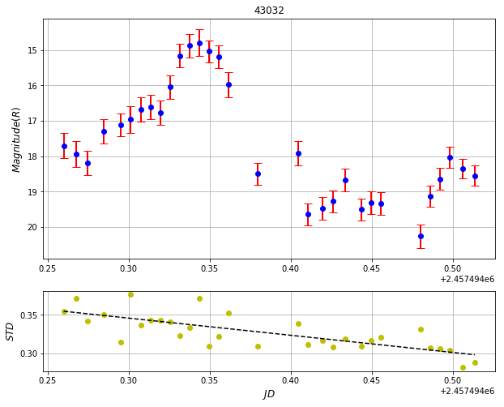

# astrolib Documentation

I decided to create a library from the codes that I use for myself. I hope it will be useful for you too.

And here are our dependencies for this library:

* [Astropy](https://astropy.readthedocs.io/en/stable/)
* [astrometry.net](http://astrometry.net)
* [numpy](http://numpy.org)
* [sep](https://sep.readthedocs.io/en/v1.0.x/)
* [matplotlib](http://matplotlib.org)
* [astroquery](http://astroquery.readthedocs.io/en/latest/)
* [ccdproc](http://ccdproc.readthedocs.io/en/latest/)
* [f2n](https://github.com/yucelkilic/A-Track/tree/master/f2n)

# Table of Contents:
* [Structure of Module](#structure)
* [Introduction](#introduction)
* [Detecting Sources](#detect-sources)
* [Plot detected sources](#plot-sources)
* [Query and match detected objects with the GAIA DR1](#query-detected-objects)
* [Matching with GAIA DR1](#gaia-match)
* [Astrometry with IRAF's ccmap](#ccmap)
* [Solve field with astrometry.net](#solve-field)
* [Plot Asteroids](#plot-asteroids)
* [Plot Asteroids without a FITS File](#plot-asteroids-without-fits)
* [FITS Data Reduction with ccdproc](#ccdproc)
* [Photometry of an asteroid](#ast_phot)


# Structure of Module <a class="anchor" id="structure"></a>
astrolib
|
|----> astronomy.py
|
|----> catalog.py
|
|----> io.py
|
|----> visuals.py
|
|----> photometry.py
For detailed information and help give help(module_name) command in the command line.

# Introduction <a class="anchor" id="introduction"></a>

Here I created help documentation for the commands I use the frequently. You can work the same way for others. You can find detailed help in the code.

# Detecting Sources <a class="anchor" id="detect-sources"></a>


```python
%load_ext autoreload
%autoreload 2
from astrolib import astronomy

fo = astronomy.FitsOps("108hecuba-001_R_affineremap.fits")
ds= fo.detect_sources(max_sources=10)
print(ds)
```

    The autoreload extension is already loaded. To reload it, use:
      %reload_ext autoreload

    10 objects detected.
        thresh    npix tnpix xmin xmax ... ypeak flag    ra_calc       dec_calc   
    ------------- ---- ----- ---- ---- ... ----- ---- ------------- --------------
    19.1716499329  514   482  770  798 ...   709    0 306.771497336 -23.4704661458
    19.1716499329  406   375  491  512 ...   328    0 306.824877954  -23.396690687
    19.1716499329  288   275  254  274 ...   447    1 306.874213526 -23.4164391737
    19.1716499329  277   256  424  442 ...   380    0 306.839362608  -23.405562815
    19.1716499329  198   181  424  440 ...   906    0 306.845308447 -23.5039523172
    19.1716499329  194   176  979  994 ...   732    0  306.73060855 -23.4768569137
    19.1716499329  191   179  421  436 ...   502    0 306.841689712 -23.4283372785
    19.1716499329  186   172  748  763 ...   535    0 306.775505562 -23.4377531371
    19.1716499329  217   195  968  983 ...   851    0 306.734126873 -23.4989537639
    19.1716499329  146   133  304  317 ...   898    0 306.869815661 -23.5011624192


If you just want to get physical coordinates of sources;


```python
print(ds['x', 'y'])
```

          x             y      
    ------------- -------------
    784.445069846 708.599934474
    501.969623282 328.856251826
    265.640606005  447.07089538
    433.446658084  379.95420757
    432.153302841 906.369369574
     986.64280869 732.173102742
    428.481743905  502.05257089
    755.619674466  535.11980348
    975.565085076 850.958300649
     311.27460779 897.879261611


# Plot detected sources <a class="anchor" id="plot-sources"></a>
If you want to plot detected objects on the FITS file;


```python
fo.detect_sources(plot=True, max_sources=10)
```


    10 objects detected.


&lt;Table length=10&gt;
<table id="table4714975184" class="table-striped table-bordered table-condensed">
<thead><tr><th>thresh</th><th>npix</th><th>tnpix</th><th>xmin</th><th>xmax</th><th>ymin</th><th>ymax</th><th>x</th><th>y</th><th>x2</th><th>y2</th><th>xy</th><th>errx2</th><th>erry2</th><th>errxy</th><th>a</th><th>b</th><th>theta</th><th>cxx</th><th>cyy</th><th>cxy</th><th>cflux</th><th>flux</th><th>cpeak</th><th>peak</th><th>xcpeak</th><th>ycpeak</th><th>xpeak</th><th>ypeak</th><th>flag</th></tr></thead>
<thead><tr><th>float64</th><th>int64</th><th>int64</th><th>int64</th><th>int64</th><th>int64</th><th>int64</th><th>float64</th><th>float64</th><th>float64</th><th>float64</th><th>float64</th><th>float64</th><th>float64</th><th>float64</th><th>float64</th><th>float64</th><th>float64</th><th>float64</th><th>float64</th><th>float64</th><th>float64</th><th>float64</th><th>float64</th><th>float64</th><th>int64</th><th>int64</th><th>int64</th><th>int64</th><th>int64</th></tr></thead>
<tr><td>19.1716499329</td><td>514</td><td>482</td><td>770</td><td>798</td><td>696</td><td>721</td><td>784.445069846</td><td>708.599934474</td><td>7.13037778034</td><td>7.14998870343</td><td>-0.212358140872</td><td>7.09243459217e-06</td><td>6.17207043114e-06</td><td>-1.98509663699e-07</td><td>2.71159863472</td><td>2.63203310966</td><td>-0.808468878269</td><td>0.140369191766</td><td>0.139984190464</td><td>0.00833806581795</td><td>723850.0</td><td>724231.8125</td><td>17705.0605469</td><td>18033.3535156</td><td>785</td><td>709</td><td>784</td><td>709</td><td>0</td></tr>
<tr><td>19.1716499329</td><td>406</td><td>375</td><td>491</td><td>512</td><td>318</td><td>340</td><td>501.969623282</td><td>328.856251826</td><td>6.85129620045</td><td>6.80527345789</td><td>-0.232098936969</td><td>1.135928646e-05</td><td>1.08330602851e-05</td><td>1.04181566067e-06</td><td>2.65735244751</td><td>2.56808257103</td><td>-0.735987305641</td><td>0.146126613021</td><td>0.14711484313</td><td>0.00996751524508</td><td>443818.09375</td><td>444089.75</td><td>13129.0449219</td><td>14977.5058594</td><td>502</td><td>329</td><td>502</td><td>328</td><td>0</td></tr>
<tr><td>19.1716499329</td><td>288</td><td>275</td><td>254</td><td>274</td><td>438</td><td>457</td><td>265.640606005</td><td>447.07089538</td><td>6.23960234427</td><td>6.07421432435</td><td>-0.279671671578</td><td>3.41360150936e-05</td><td>3.11016713517e-05</td><td>-2.11652827665e-06</td><td>2.53939938545</td><td>2.4218313694</td><td>-0.641652643681</td><td>0.160598054528</td><td>0.164970800281</td><td>0.0147886537015</td><td>185113.59375</td><td>185279.53125</td><td>6102.23291016</td><td>7160.66992188</td><td>266</td><td>447</td><td>266</td><td>447</td><td>1</td></tr>
<tr><td>19.1716499329</td><td>277</td><td>256</td><td>424</td><td>442</td><td>371</td><td>389</td><td>433.446658084</td><td>379.95420757</td><td>6.35316222658</td><td>6.31800704473</td><td>-0.299843333379</td><td>4.85704037652e-05</td><td>4.50648124042e-05</td><td>-1.72250253383e-06</td><td>2.57603240013</td><td>2.45666980743</td><td>-0.756120383739</td><td>0.157755285501</td><td>0.158633068204</td><td>0.0149736674502</td><td>146899.203125</td><td>147146.46875</td><td>4537.37988281</td><td>5280.50488281</td><td>434</td><td>380</td><td>434</td><td>380</td><td>0</td></tr>
<tr><td>19.1716499329</td><td>198</td><td>181</td><td>424</td><td>440</td><td>899</td><td>914</td><td>432.153302841</td><td>906.369369574</td><td>5.90303042003</td><td>5.47633612435</td><td>-0.184753256665</td><td>0.000164622405043</td><td>0.000146496989951</td><td>-3.67874889536e-06</td><td>2.44374871254</td><td>2.32539439201</td><td>-0.356847733259</td><td>0.169583573937</td><td>0.182796850801</td><td>0.0114423651248</td><td>57640.0429688</td><td>57828.2695312</td><td>1876.25524902</td><td>2155.50537109</td><td>432</td><td>906</td><td>432</td><td>906</td><td>0</td></tr>
<tr><td>19.1716499329</td><td>194</td><td>176</td><td>979</td><td>994</td><td>725</td><td>740</td><td>986.64280869</td><td>732.173102742</td><td>5.8286040971</td><td>5.77761345379</td><td>-0.123682777674</td><td>0.000149828861925</td><td>0.000146736762267</td><td>-1.92272602728e-06</td><td>2.43503427505</td><td>2.38260889053</td><td>-0.683754503727</td><td>0.171645641327</td><td>0.173160508275</td><td>0.00734891975299</td><td>57640.6875</td><td>57787.3632812</td><td>1833.14978027</td><td>2154.9621582</td><td>987</td><td>732</td><td>987</td><td>732</td><td>0</td></tr>
<tr><td>19.1716499329</td><td>191</td><td>179</td><td>421</td><td>436</td><td>494</td><td>509</td><td>428.481743905</td><td>502.05257089</td><td>5.73049328878</td><td>5.83927472126</td><td>-0.08271646368</td><td>0.000185882394818</td><td>0.000196906906581</td><td>6.81651164286e-06</td><td>2.42567110062</td><td>2.38450980186</td><td>-1.07623255253</td><td>0.174540728331</td><td>0.171289175749</td><td>0.00494492659345</td><td>49968.703125</td><td>50177.390625</td><td>1583.44250488</td><td>1840.37927246</td><td>429</td><td>502</td><td>429</td><td>502</td><td>0</td></tr>
<tr><td>19.1716499329</td><td>186</td><td>172</td><td>748</td><td>763</td><td>528</td><td>543</td><td>755.619674466</td><td>535.11980348</td><td>5.84952315959</td><td>5.86444076657</td><td>-0.302552966408</td><td>0.000190548947294</td><td>0.000193111256106</td><td>-1.3837525619e-05</td><td>2.48185944557</td><td>2.35676407814</td><td>-0.797722101212</td><td>0.171411499381</td><td>0.170975476503</td><td>0.0176866166294</td><td>48653.1601562</td><td>48840.03125</td><td>1514.21801758</td><td>1737.78015137</td><td>756</td><td>535</td><td>756</td><td>535</td><td>0</td></tr>
<tr><td>19.1716499329</td><td>217</td><td>195</td><td>968</td><td>983</td><td>837</td><td>859</td><td>975.565085076</td><td>850.958300649</td><td>5.45041439198</td><td>8.61544221634</td><td>-0.369553518093</td><td>0.000244768135719</td><td>0.000640536321842</td><td>-2.73328688175e-05</td><td>2.94245123863</td><td>2.32547569275</td><td>-1.45609033108</td><td>0.184007450938</td><td>0.116409212351</td><td>0.015785748139</td><td>41191.078125</td><td>41409.0390625</td><td>1270.40551758</td><td>1463.90539551</td><td>976</td><td>851</td><td>976</td><td>851</td><td>0</td></tr>
<tr><td>19.1716499329</td><td>146</td><td>133</td><td>304</td><td>317</td><td>891</td><td>904</td><td>311.27460779</td><td>897.879261611</td><td>4.95460770899</td><td>5.00588141734</td><td>-0.189383535264</td><td>0.000252084341226</td><td>0.000276073972364</td><td>-1.24180158269e-05</td><td>2.27406144142</td><td>2.18840885162</td><td>-0.852674245834</td><td>0.202124610543</td><td>0.200054317713</td><td>0.0152936400846</td><td>32531.5585938</td><td>32735.9355469</td><td>1089.45288086</td><td>1271.76538086</td><td>311</td><td>898</td><td>311</td><td>898</td><td>0</td></tr>
</table>


# Query and match detected objects with the GAIA DR1<a class="anchor" id="query-detected-objetcs"></a>


```python
from astrolib import catalog
q = catalog.Query()
q.gaia_query(306.77168051, -23.47029011, 0.1, max_sources=5)
```


&lt;Table masked=True length=5&gt;
<table id="table4585081320" class="table-striped table-bordered table-condensed">
<thead><tr><th>Source</th><th>RA_ICRS</th><th>DE_ICRS</th><th>e_RA_ICRS</th><th>e_DE_ICRS</th><th>__Gmag_</th><th>pmRA</th><th>pmDE</th><th>e_pmRA</th><th>e_pmDE</th><th>Epoch</th><th>Plx</th></tr></thead>
<thead><tr><th></th><th>deg</th><th>deg</th><th>mas</th><th>mas</th><th>mag</th><th>mas / yr</th><th>mas / yr</th><th>mas / yr</th><th>mas / yr</th><th>yr</th><th>mas</th></tr></thead>
<thead><tr><th>int64</th><th>float64</th><th>float64</th><th>float32</th><th>float32</th><th>float32</th><th>float64</th><th>float64</th><th>float32</th><th>float32</th><th>float32</th><th>float32</th></tr></thead>
<tr><td>6849534850623923456</td><td>306.7733664604</td><td>-23.5149644759</td><td>0.262</td><td>0.221</td><td>17.121</td><td>--</td><td>--</td><td>--</td><td>--</td><td>2015.0</td><td>--</td></tr>
<tr><td>6849534850623925120</td><td>306.7712467689</td><td>-23.5125792734</td><td>0.870</td><td>0.749</td><td>19.499</td><td>--</td><td>--</td><td>--</td><td>--</td><td>2015.0</td><td>--</td></tr>
<tr><td>6849534988062874624</td><td>306.7217934709</td><td>-23.5187662526</td><td>0.690</td><td>0.589</td><td>19.120</td><td>--</td><td>--</td><td>--</td><td>--</td><td>2015.0</td><td>--</td></tr>
<tr><td>6849534988062875264</td><td>306.7263979238</td><td>-23.5181699239</td><td>0.325</td><td>0.264</td><td>17.535</td><td>--</td><td>--</td><td>--</td><td>--</td><td>2015.0</td><td>--</td></tr>
<tr><td>6849535056782354560</td><td>306.7183059223</td><td>-23.5126694863</td><td>0.196</td><td>0.133</td><td>17.308</td><td>--</td><td>--</td><td>--</td><td>--</td><td>2015.0</td><td>--</td></tr>
</table>

If you just want to query the target object, reduce the radius like;

```python
from astrolib import catalog
q = catalog.Query()
q.gaia_query(306.77168051, -23.47029011, 0.01, max_sources=5)
```

&lt;Table masked=True length=1&gt;
<table id="table4801240648" class="table-striped table-bordered table-condensed">
<thead><tr><th>Source</th><th>RA_ICRS</th><th>DE_ICRS</th><th>e_RA_ICRS</th><th>e_DE_ICRS</th><th>__Gmag_</th><th>pmRA</th><th>pmDE</th><th>e_pmRA</th><th>e_pmDE</th><th>Epoch</th><th>Plx</th></tr></thead>
<thead><tr><th></th><th>deg</th><th>deg</th><th>mas</th><th>mas</th><th>mag</th><th>mas / yr</th><th>mas / yr</th><th>mas / yr</th><th>mas / yr</th><th>yr</th><th>mas</th></tr></thead>
<thead><tr><th>int64</th><th>float64</th><th>float64</th><th>float32</th><th>float32</th><th>float32</th><th>float64</th><th>float64</th><th>float32</th><th>float32</th><th>float32</th><th>float32</th></tr></thead>
<tr><td>6849629099386034304</td><td>306.7717090460</td><td>-23.4702787742</td><td>0.216</td><td>0.126</td><td>9.603</td><td>8.059</td><td>4.816</td><td>0.910</td><td>0.619</td><td>2015.0</td><td>3.17</td></tr>
</table>


# Matching with GAIA DR1 <a class="anchor" id="gaia-match"></a>

```python
q.match_catalog("108hecuba-001_R_affineremap.fits", plot=True, max_sources=10)
```


    10 objects detected.


    /usr/local/lib/python3.6/site-packages/numpy/core/numeric.py:531: UserWarning: Warning: converting a masked element to nan.
      return array(a, dtype, copy=False, order=order)


    Matched objects: 9


&lt;Table length=9&gt;
<table id="table4801201768" class="table-striped table-bordered table-condensed">
<thead><tr><th>id</th><th>x</th><th>y</th><th>ra</th><th>dec</th><th>e_ra</th><th>e_dec</th><th>g_mean_mag</th><th>pmra</th><th>pmdec</th><th>e_pmra</th><th>e_pmdec</th><th>epoch</th><th>plx</th><th>flux</th><th>a</th><th>b</th><th>theta</th><th>ra_calc</th><th>dec_calc</th><th>ra_diff</th><th>dec_diff</th></tr></thead>
<thead><tr><th>float64</th><th>float64</th><th>float64</th><th>float64</th><th>float64</th><th>float64</th><th>float64</th><th>float64</th><th>float64</th><th>float64</th><th>float64</th><th>float64</th><th>float64</th><th>float64</th><th>float64</th><th>float64</th><th>float64</th><th>float64</th><th>float64</th><th>float64</th><th>float64</th><th>float64</th></tr></thead>
<tr><td>6.84962909939e+18</td><td>784.445069846</td><td>708.599934474</td><td>306.771709046</td><td>-23.4702787742</td><td>0.216000005603</td><td>0.126000002027</td><td>9.60299968719</td><td>8.059</td><td>4.816</td><td>0.910000026226</td><td>0.619000017643</td><td>2015.0</td><td>3.17000007629</td><td>724231.8125</td><td>2.71159863472</td><td>2.63203310966</td><td>-0.808468878269</td><td>306.771497336</td><td>-23.4704661458</td><td>762.154325162</td><td>674.53790621</td></tr>
<tr><td>6.84964298072e+18</td><td>501.969623282</td><td>328.856251826</td><td>306.825119424</td><td>-23.3966105431</td><td>0.155000001192</td><td>0.0960000008345</td><td>10.1719999313</td><td>nan</td><td>nan</td><td>nan</td><td>nan</td><td>2015.0</td><td>nan</td><td>444089.75</td><td>2.65735244751</td><td>2.56808257103</td><td>-0.735987305641</td><td>306.824877954</td><td>-23.396690687</td><td>869.293691494</td><td>288.518125998</td></tr>
<tr><td>6.84963092045e+18</td><td>265.640606005</td><td>447.07089538</td><td>306.874457724</td><td>-23.4164026349</td><td>0.34999999404</td><td>0.171000003815</td><td>11.0909996033</td><td>19.918</td><td>-7.057</td><td>1.93099999428</td><td>1.28299999237</td><td>2015.0</td><td>3.65000009537</td><td>185279.53125</td><td>2.53939938545</td><td>2.4218313694</td><td>-0.641652643681</td><td>306.874213526</td><td>-23.4164391737</td><td>879.11293615</td><td>131.539743526</td></tr>
<tr><td>6.84963122969e+18</td><td>433.446658084</td><td>379.95420757</td><td>306.839605839</td><td>-23.4054917128</td><td>0.195999994874</td><td>0.140000000596</td><td>11.3380002975</td><td>-1.037</td><td>-1.896</td><td>1.43299996853</td><td>0.952000021935</td><td>2015.0</td><td>0.579999983311</td><td>147146.46875</td><td>2.57603240013</td><td>2.45666980743</td><td>-0.756120383739</td><td>306.839362608</td><td>-23.405562815</td><td>875.629978918</td><td>255.967955209</td></tr>
<tr><td>6.84962782808e+18</td><td>432.153302841</td><td>906.369369574</td><td>306.845545923</td><td>-23.5038156954</td><td>0.231999993324</td><td>0.163000002503</td><td>12.3310003281</td><td>-6.099</td><td>-11.584</td><td>1.67200005054</td><td>1.0909999609</td><td>2015.0</td><td>1.14999997616</td><td>57828.2695312</td><td>2.44374871254</td><td>2.32539439201</td><td>-0.356847733259</td><td>306.845308447</td><td>-23.5039523172</td><td>854.913985108</td><td>491.838601999</td></tr>
<tr><td>6.84954694525e+18</td><td>986.64280869</td><td>732.173102742</td><td>306.730808533</td><td>-23.4766263796</td><td>0.152999997139</td><td>0.119999997318</td><td>12.3090000153</td><td>nan</td><td>nan</td><td>nan</td><td>nan</td><td>2015.0</td><td>nan</td><td>57787.3632812</td><td>2.43503427505</td><td>2.38260889053</td><td>-0.683754503727</td><td>306.73060855</td><td>-23.4768569137</td><td>719.935376696</td><td>829.922643453</td></tr>
<tr><td>6.8496409535e+18</td><td>755.619674466</td><td>535.11980348</td><td>306.775712653</td><td>-23.4375940654</td><td>0.097000002861</td><td>0.0750000029802</td><td>12.5030002594</td><td>nan</td><td>nan</td><td>nan</td><td>nan</td><td>2015.0</td><td>nan</td><td>48840.03125</td><td>2.48185944557</td><td>2.35676407814</td><td>-0.797722101212</td><td>306.775505562</td><td>-23.4377531371</td><td>745.527969957</td><td>572.658003705</td></tr>
<tr><td>6.84953515986e+18</td><td>975.565085076</td><td>850.958300649</td><td>306.734327716</td><td>-23.4987547309</td><td>0.104999996722</td><td>0.082000002265</td><td>12.7259998322</td><td>nan</td><td>nan</td><td>nan</td><td>nan</td><td>2015.0</td><td>nan</td><td>41409.0390625</td><td>2.94245123863</td><td>2.32547569275</td><td>-1.45609033108</td><td>306.734126873</td><td>-23.4989537639</td><td>723.032314954</td><td>716.51890772</td></tr>
<tr><td>6.84962820603e+18</td><td>311.27460779</td><td>897.879261611</td><td>306.870049861</td><td>-23.5010591944</td><td>0.109999999404</td><td>0.0729999989271</td><td>12.875</td><td>nan</td><td>nan</td><td>nan</td><td>nan</td><td>2015.0</td><td>nan</td><td>32735.9355469</td><td>2.27406144142</td><td>2.18840885162</td><td>-0.852674245834</td><td>306.869815661</td><td>-23.5011624192</td><td>843.118385296</td><td>371.609451281</td></tr>
</table>


# Astrometry with IRAF's ccmap <a class="anchor" id="ccmap"></a>

First of all we need a FITS file that has been resolved with astrometry.net (For example: 108hecuba-001_R_affineremap.fits). Then our code will map the resources found here to the GAIA catalog and again perform astrometry with these coordinates via [ccmap](http://stsdas.stsci.edu/cgi-bin/gethelp.cgi?ccmap).


```python
from astrolib import catalog
from astrolib import astronomy


q = catalog.Query()
# Resolved image with Astrometry.net (108hecuba-001_R_affineremap.fits).
objects_matrix = q.match_catalog("108hecuba-001_R_affineremap.fits", max_sources=20)

ac = astronomy.AstCalc()
# Image with no WCS header keywords (108hecuba-001_R.fits).
ac.ccmap(objects_matrix, "./108hecuba-001_R.fits", ppm_parallax_cor=False)
```


    20 objects detected.

    Matched objects: 19
    Refsystem: icrs  Coordinates: equatorial ICRS
        Equinox: J2000.000 Epoch: J2000.00000000 MJD: 51544.50000
    Insystem: icrs  Coordinates: equatorial ICRS
        Equinox: J2000.000 Epoch: J2000.00000000 MJD: 51544.50000
    
    Coords File: /Users/ykilic/Documents/playground/coords  Image: ./108hecuba-001_R.fits
        Database: /Users/ykilic/Documents/playground/solutions.txt  Solution: ./108hecuba-001_R.fits
    Coordinate mapping status
        XI fit ok.  ETA fit ok.
        Ra/Dec or Long/Lat fit rms: 0.038  0.0485   (arcsec  arcsec)
    Coordinate mapping parameters
        Sky projection geometry: tan
        Reference point: 20:27:17.965  -23:27:09.36  (hours  degrees)
        Reference point: 519.031  627.677  (pixels  pixels)
        X and Y scale: 0.673  0.673  (arcsec/pixel  arcsec/pixel)
        X and Y axis rotation: 177.025  176.983  (degrees  degrees)
    Wcs mapping status
        Ra/Dec or Long/Lat wcs rms: 0.038  0.0485   (arcsec  arcsec)
    Updating image header wcs

&lt;Table length=3&gt;
<table id="table4757776088" class="table-striped table-bordered table-condensed">
<thead><tr><th>Ra/Dec or Long/Lat fit rms</th><th>Ra/Dec or Long/Lat wcs rms</th><th>Reference point (RA, DEC)</th><th>Reference point (X, Y)</th><th>X and Y scale</th><th>X and Y axis rotation</th></tr></thead>
<thead><tr><th>str16</th><th>str16</th><th>str16</th><th>str16</th><th>str28</th><th>str18</th></tr></thead>
<tr><td>0.038</td><td>0.038</td><td>20:27:17.965</td><td>519.031</td><td>0.673</td><td>177.025</td></tr>
<tr><td>0.0485</td><td>0.0485</td><td>-23:27:09.36</td><td>627.677</td><td>0.673</td><td>176.983</td></tr>
<tr><td>(arcsec  arcsec)</td><td>(arcsec  arcsec)</td><td>(hours  degrees)</td><td>(pixels  pixels)</td><td>(arcsec/pixel  arcsec/pixel)</td><td>(degrees  degrees)</td></tr>
</table>

You can see the results coordinates with;

```python
ac.ccmap(objects_matrix, "./108hecuba-001_R.fits", ppm_parallax_cor=False, stdout=True)
```

    Refsystem: icrs  Coordinates: equatorial ICRS
        Equinox: J2000.000 Epoch: J2000.00000000 MJD: 51544.50000
    Insystem: icrs  Coordinates: equatorial ICRS
        Equinox: J2000.000 Epoch: J2000.00000000 MJD: 51544.50000
    
    Coords File: /Users/ykilic/Documents/playground/coords  Image: ./108hecuba-001_R.fits
        Database: /Users/ykilic/Documents/playground/solutions.txt  Solution: ./108hecuba-001_R.fits
    Coordinate mapping status
        XI fit ok.  ETA fit ok.
        Ra/Dec or Long/Lat fit rms: 0.038  0.0485   (arcsec  arcsec)
    Coordinate mapping parameters
        Sky projection geometry: tan
        Reference point: 20:27:17.965  -23:27:09.36  (hours  degrees)
        Reference point: 519.031  627.677  (pixels  pixels)
        X and Y scale: 0.673  0.673  (arcsec/pixel  arcsec/pixel)
        X and Y axis rotation: 177.025  176.983  (degrees  degrees)
    Wcs mapping status
        Ra/Dec or Long/Lat wcs rms: 0.038  0.0485   (arcsec  arcsec)
    Updating image header wcs
    
    # Refsystem: icrs  Coordinates: equatorial ICRS
    #     Equinox: J2000.000 Epoch: J2000.00000000 MJD: 51544.50000
    # Insystem: icrs  Coordinates: equatorial ICRS
    #     Equinox: J2000.000 Epoch: J2000.00000000 MJD: 51544.50000
    
    # Coords File: /Users/ykilic/Documents/playground/coords  Image: ./108hecuba-001_R.fits
    #     Database: /Users/ykilic/Documents/playground/solutions.txt  Solution: ./108hecuba-001_R.fits
    # Coordinate mapping status
    #     XI fit ok.  ETA fit ok.
    #     Ra/Dec or Long/Lat fit rms: 0.038  0.0485   (arcsec  arcsec)
    # Coordinate mapping parameters
    #     Sky projection geometry: tan
    #     Reference point: 20:27:17.965  -23:27:09.36  (hours  degrees)
    #     Reference point: 519.031  627.677  (pixels  pixels)
    #     X and Y scale: 0.673  0.673  (arcsec/pixel  arcsec/pixel)
    #     X and Y axis rotation: 177.025  176.983  (degrees  degrees)
    # Wcs mapping status
    #     Ra/Dec or Long/Lat wcs rms: 0.038  0.0485   (arcsec  arcsec)
    # Updating image header wcs
    
    
    # Input Coordinate Listing
    #     Column 1: X (pixels)
    #     Column 2: Y (pixels)
    #     Column 3: Ra / Longitude (hours)
    #     Column 4: Dec / Latitude (degrees)
    #     Column 5: Fitted Ra / Longitude (hours)
    #     Column 6: Fitted Dec / Latitude (degrees)
    #     Column 7: Residual Ra / Longitude (arcseconds)
    #     Column 8: Residual Dec / Latitude (arcseconds)
    
       784.445    708.600  20:27:05.210 -23:28:13.00  20:27:05.210 -23:28:13.02   0.005  0.018
       501.970    328.856  20:27:18.029 -23:23:47.80  20:27:18.028 -23:23:47.80   0.005  0.006
       265.641    447.071  20:27:29.870 -23:24:59.05  20:27:29.871 -23:24:59.02  -0.014 -0.026
       433.447    379.954  20:27:21.505 -23:24:19.77  20:27:21.505 -23:24:19.77   0.005  0.002
       432.153    906.369  20:27:22.931 -23:30:13.74  20:27:22.927 -23:30:13.75   0.051  0.013
       986.643    732.173  20:26:55.394 -23:28:35.85  20:26:55.394 -23:28:35.87   0.006  0.013
       755.620    535.120  20:27:06.171 -23:26:15.34  20:27:06.174 -23:26:15.35  -0.037  0.013
       975.565    850.958  20:26:56.239 -23:29:55.52  20:26:56.237 -23:29:55.37   0.022 -0.143
       311.275    897.879  20:27:28.812 -23:30:03.81  20:27:28.811 -23:30:03.80   0.017 -0.014
        29.622    370.084  20:27:41.190 -23:23:58.91  20:27:41.193 -23:23:58.93  -0.044  0.014
       397.766    476.658  20:27:23.496 -23:25:23.58  20:27:23.497 -23:25:23.56  -0.010 -0.017
       670.751    693.912  20:27:10.729 -23:27:59.25  20:27:10.725 -23:27:59.20   0.045 -0.052
       189.583    760.212  20:27:34.392 -23:28:26.92  20:27:34.398 -23:28:26.94  -0.085  0.020
       185.898    512.106  20:27:33.936 -23:25:39.96  20:27:33.933 -23:25:39.95   0.042 -0.009
       577.371    579.237  20:27:14.995 -23:26:38.81  20:27:14.991 -23:26:38.82   0.056  0.008
      1003.779    979.693  20:26:55.184 -23:31:22.81  20:26:55.186 -23:31:22.93  -0.028  0.111
       179.822    591.192  20:27:34.437 -23:26:32.96  20:27:34.435 -23:26:32.92   0.026 -0.031
       221.017    307.520  20:27:31.687 -23:23:23.55  20:27:31.687 -23:23:23.61  -0.001  0.051
       956.476    867.597  20:26:57.208 -23:30:05.88  20:26:57.212 -23:30:05.91  -0.059  0.023


&lt;Table length=3&gt;
<table id="table4757811720" class="table-striped table-bordered table-condensed">
<thead><tr><th>Ra/Dec or Long/Lat fit rms</th><th>Ra/Dec or Long/Lat wcs rms</th><th>Reference point (RA, DEC)</th><th>Reference point (X, Y)</th><th>X and Y scale</th><th>X and Y axis rotation</th></tr></thead>
<thead><tr><th>str16</th><th>str16</th><th>str16</th><th>str16</th><th>str28</th><th>str18</th></tr></thead>
<tr><td>0.038</td><td>0.038</td><td>20:27:17.965</td><td>519.031</td><td>0.673</td><td>177.025</td></tr>
<tr><td>0.0485</td><td>0.0485</td><td>-23:27:09.36</td><td>627.677</td><td>0.673</td><td>176.983</td></tr>
<tr><td>(arcsec  arcsec)</td><td>(arcsec  arcsec)</td><td>(hours  degrees)</td><td>(pixels  pixels)</td><td>(arcsec/pixel  arcsec/pixel)</td><td>(degrees  degrees)</td></tr>
</table>

But this solution does not include parallax and proper motion correction. To include these corrections;

```python
ac.ccmap(objects_matrix, "./108hecuba-001_R.fits", ppm_parallax_cor=True)
```

    Refsystem: icrs  Coordinates: equatorial ICRS
        Equinox: J2000.000 Epoch: J2000.00000000 MJD: 51544.50000
    Insystem: icrs  Coordinates: equatorial ICRS
        Equinox: J2000.000 Epoch: J2000.00000000 MJD: 51544.50000
    
    Coords File: /Users/ykilic/Documents/playground/coords  Image: ./108hecuba-001_R.fits
        Database: /Users/ykilic/Documents/playground/solutions.txt  Solution: ./108hecuba-001_R.fits
    Coordinate mapping status
        XI fit ok.  ETA fit ok.
        Ra/Dec or Long/Lat fit rms: 0.0377  0.0486   (arcsec  arcsec)
    Coordinate mapping parameters
        Sky projection geometry: tan
        Reference point: 20:27:17.965  -23:27:09.36  (hours  degrees)
        Reference point: 519.031  627.677  (pixels  pixels)
        X and Y scale: 0.673  0.673  (arcsec/pixel  arcsec/pixel)
        X and Y axis rotation: 177.025  176.983  (degrees  degrees)
    Wcs mapping status
        Ra/Dec or Long/Lat wcs rms: 0.0377  0.0486   (arcsec  arcsec)
    Updating image header wcs
    
&lt;Table length=3&gt;
<table id="table4758064544" class="table-striped table-bordered table-condensed">
<thead><tr><th>Ra/Dec or Long/Lat fit rms</th><th>Ra/Dec or Long/Lat wcs rms</th><th>Reference point (RA, DEC)</th><th>Reference point (X, Y)</th><th>X and Y scale</th><th>X and Y axis rotation</th></tr></thead>
<thead><tr><th>str16</th><th>str16</th><th>str16</th><th>str16</th><th>str28</th><th>str18</th></tr></thead>
<tr><td>0.0377</td><td>0.0377</td><td>20:27:17.965</td><td>519.031</td><td>0.673</td><td>177.025</td></tr>
<tr><td>0.0486</td><td>0.0486</td><td>-23:27:09.36</td><td>627.677</td><td>0.673</td><td>176.983</td></tr>
<tr><td>(arcsec  arcsec)</td><td>(arcsec  arcsec)</td><td>(hours  degrees)</td><td>(pixels  pixels)</td><td>(arcsec/pixel  arcsec/pixel)</td><td>(degrees  degrees)</td></tr>
</table>

### Proper motion correction;

Coordinates α and δ of a star in a fixed reference system change with time proportional to its proper motion μα and μδ. Let α0 and δ0 be its position at some time origin; its values at time t are;

μα = μα∗ / cosδ0

α = α0 + tμα

δ = δ0 + tμδ

### Stellar Parallax Correction;

Deltaα = π (x sin α − y cos α) / cos δ

Deltaδ = π [(x cos α + y sin α) sin δ − z cos δ]

where the coordinates x, y, z of the Earth are expressed in astronomical units and the corrections to the position are in arcseconds.

*Ref: Kovalevsky, J., & Seidelmann, P. (2004). Fundamentals of Astrometry. Cambridge: Cambridge University Press. doi:10.1017/CBO9781139106832*

# Solve field with astrometry.net <a class="anchor" id="solve-field"></a>


```python
from astrolib import astronomy

ac = astronomy.AstCalc()

# Solve field with astrometry.net
# Please provide image path, so ./ is important!
ac.solve_field("./5247_0007_R.fits")
```

    Image has been solved!

    True

```python
pwd
```

    '/Users/ykilic/Documents/playground'

**Copy solved image with FITS file extension.**


```python
cp -rv 5247_0007_R.new 5247_0007_R_new.fits
```

    5247_0007_R.new -> 5247_0007_R_new.fits


# Plot Asteroids <a class="anchor" id="plot-asteroids"></a>

You may want to plot asteroids, comets etc. on FITS image. Especially this can be very useful to find the moving objects in asteroid observations. Note that in the header of the FITS file, there must be RA, DEC, and DATE-OBS keywords. This code has made use of [IMCCE's SkyBoT VO tool](http://vo.imcce.fr/webservices/skybot/).


```python
from astrolib import visuals

ap = visuals.StarPlot()
# time_travel parameter expresses the observation time in hours.
ap.asteroids_plot("./5247_0007_R_new.fits", time_travel=4)
```


    num   name      ra(h)       dec(deg)    class   m_v  err(arcsec) d(arcsec)
    ---- ------ ------------- ------------ -------- ---- ----------- ---------
    5247 Krylov 20 58 36.6685 +26 02 0.871 MB>Inner 15.3       0.040   159.851

    True

# Plot Asteroids without a FITS File <a class="anchor" id="plot-asteroids-without-fits"></a>

Suppose that you do not have a FITS file, but you want to plot asteroids in the field of view (in arcmin) that you want at a particular time in a particular region. Then you should have indicated the coordinates of the region (RA, DEC) and the time of observation you wanted. No that, time_travel parameter expresses the approximate observation time duration in hours.


```python
from astrolib import visuals

ap = visuals.StarPlot()
ap.asteroids_plot(ra="20 11 38.6159", 
                  dec="-07 09 12.734", 
                  odate="2017-08-15T19:50:00.95", 
                  time_travel=4, 
                  radius=21,
                  max_mag=21)
```

    Target Coordinates: 20:11:38.6159 -07:09:12.734 in 21 arcmin


     num      name        ra(h)        dec(deg)   ... m_v  err(arcsec) d(arcsec)
    ------ ---------- ------------- ------------- ... ---- ----------- ---------
     61174  2000 NN22 20 11 37.0007 -07 09 28.118 ... 17.1       0.088    28.541
    368990 2007 EA170 20 11 10.5560 -07 09 25.010 ... 20.8       0.041   417.801
     84962   2003 YM9 20 12 20.6282 -07 04 58.914 ... 19.2       0.080   674.879
         -  2003 UU95 20 11 42.2090 -07 20 33.771 ... 19.1       0.463   683.135
    462308  2008 GM89 20 11 47.4887  -07 23 2.466 ... 21.1       0.428   840.175
    154028  2002 CV42 20 10 33.0059 -07 15 32.548 ... 19.9       0.063  1047.658
    416647  2004 TA96 20 10 40.5785  -07 20 1.355 ... 20.3       0.259  1080.074
    490226  2008 VH54 20 10 56.7180 -07 24 32.520 ... 20.8       0.172  1111.152

    True

# FITS Data Reduction with ccdproc <a class="anchor" id="ccdproc"></a>

This class provides simple FITS image data reduction with [ccdproc](http://ccdproc.readthedocs.io/en/latest/). In order to use RedOps() class of my astrolib, you should have special directory tree like this;

```python
dir/
|    \
BDF/  SCI_IMAGES
```

Now, you are ready to use RedOps.ccdproc function;


```python
from astrolib import astronomy
import glob
ro = astronomy.RedOps()
ro.ccdproc("./data/20160415N/43032/")
```

    >>> Scientific images are copied!
    >>> Calibration images are copied!
    >>> Master bias file is created.
    >>> Master flat file is created.
    >>> ccdproc is working for: 43032_0001_R_new.fits
        [*] Gain correction is done.
        [*] Cosmic correction is done.
        [*] Bias correction is done.
        [*] Flat correction is done.
        [*] ccdproc is done for: 43032_0001_R_new.fits: [#-------------------] 2.63%
    >>> ccdproc is working for: 43032_0002_R_new.fits
        [*] Gain correction is done.
        [*] Cosmic correction is done.
        [*] Bias correction is done.
        [*] Flat correction is done.
        ...
    >>> ccdproc is working for: 43032_0042_R_new.fits
        [*] Gain correction is done.
        [*] Cosmic correction is done.
        [*] Bias correction is done.
        [*] Flat correction is done.
        [*] ccdproc is done for: 43032_0042_R_new.fits: [####################] 100.0%
    DONE

    True

You will find your calibrated images under *atmp/* directory as named "bf_" prefix.

# Photometry of an asteroid <a class="anchor" id="ast_phot"></a>

If you want to apply asteroid photometry on a squential FITS images give this commands. Don't forget! All images must have WCS keywords and astrometrically solved. If you change the "multi_object" value as True, asteroids_phot function will perform photometry to all asteroids in the frame queried from SkyBoT.


```python
from astrolib import photometry
from astrolib import visuals
import glob
ap = photometry.PhotOps()
plc = visuals.StarPlot()
ap.asteroids_phot("atmp/*.fits", multi_object=False)
# For plotting ligt curve of results.
plc.lc_plot("43032.txt")
```

    Photometry is done for: atmp/43032_0011_R_new.fits: [--------------------] 0.0%
    ...
    Photometry done!: [####################] 100%
    DONE
    
    Plotting asteroid's LC...



To be continued! :)
